# Summary of 2_DecisionTree

[<< Go back](../README.md)

## Decision Tree
- **n_jobs**: -1
- **criterion**: gini
- **max_depth**: 3
- **explain_level**: 2

## Validation
 - **validation_type**: split
 - **train_ratio**: 0.75
 - **shuffle**: True
 - **stratify**: True

## Optimized metric
logloss

## Training time

25.6 seconds

## Metric details
|           |    score |   threshold |
|:----------|---------:|------------:|
| logloss   | 0.38019  |  nan        |
| auc       | 0.842445 |  nan        |
| f1        | 0.615729 |    0.300851 |
| accuracy  | 0.83751  |    0.64252  |
| precision | 0.982143 |    0.828245 |
| recall    | 0.999323 |    0        |
| mcc       | 0.513824 |    0.64252  |

## Confusion matrix (at threshold=0.64252)
|                  |   Predicted as <=50K |   Predicted as >50K |
|:-----------------|---------------------:|--------------------:|
| Labeled as <=50K |                 4405 |                 222 |
| Labeled as >50K  |                  770 |                 708 |

## Learning curves
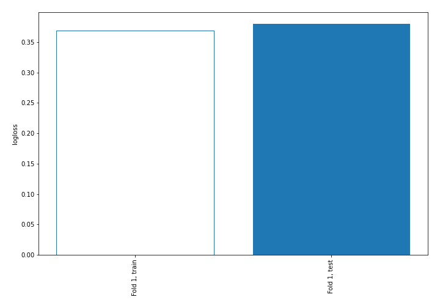

## Permutation-based Importance
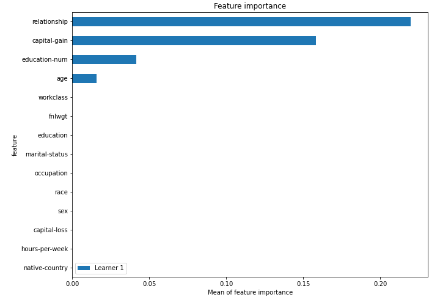
## Confusion Matrix

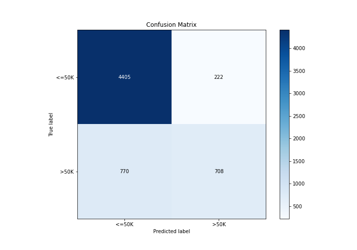

## Normalized Confusion Matrix

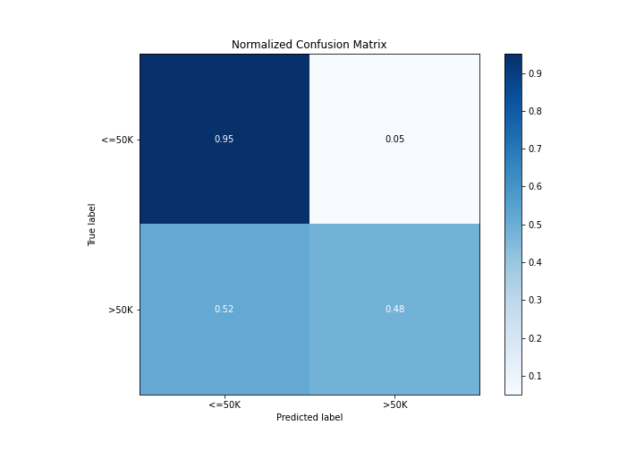

## ROC Curve

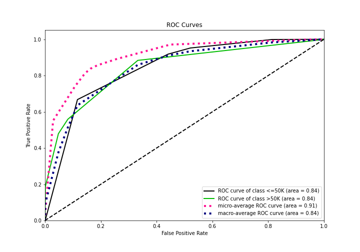

## Kolmogorov-Smirnov Statistic

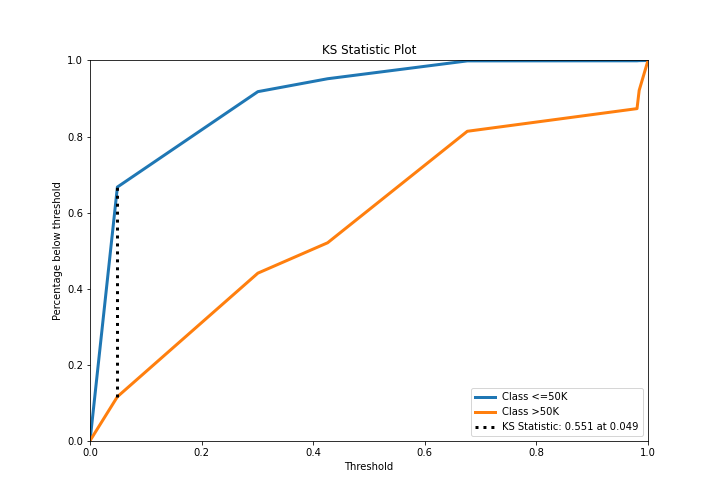

## Precision-Recall Curve

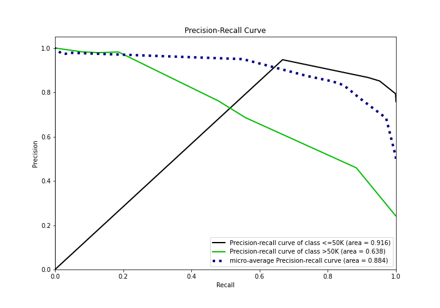

## Calibration Curve

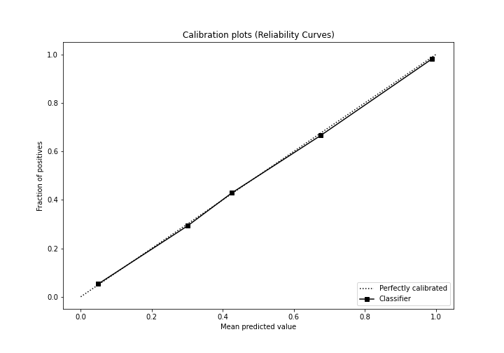

## Cumulative Gains Curve

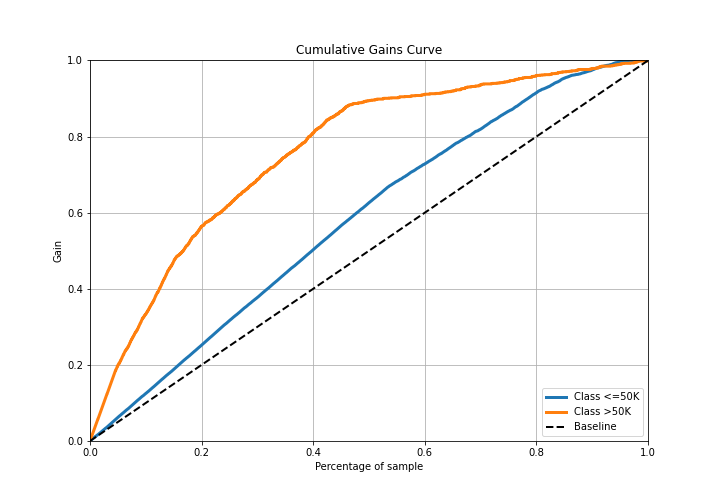

## Lift Curve

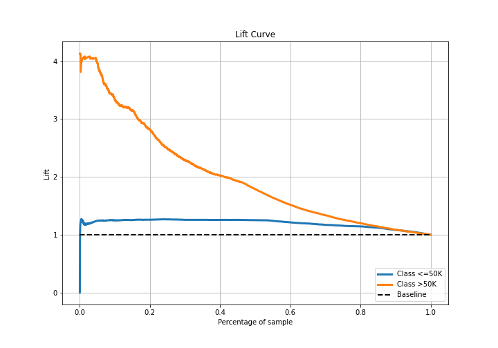

## SHAP Importance
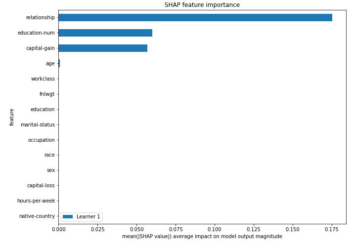

## SHAP Dependence plots

### Dependence (Fold 1)
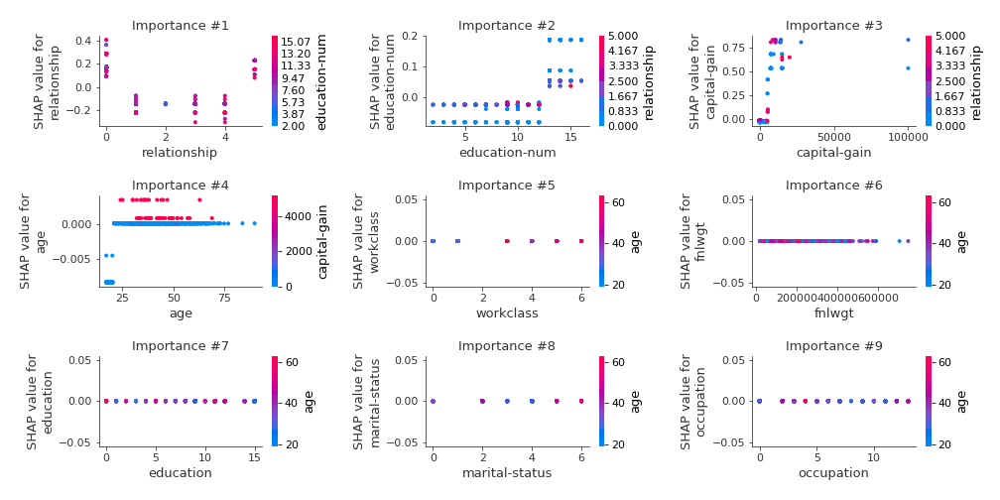

[<< Go back](../README.md)
