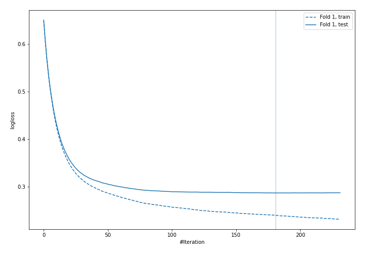
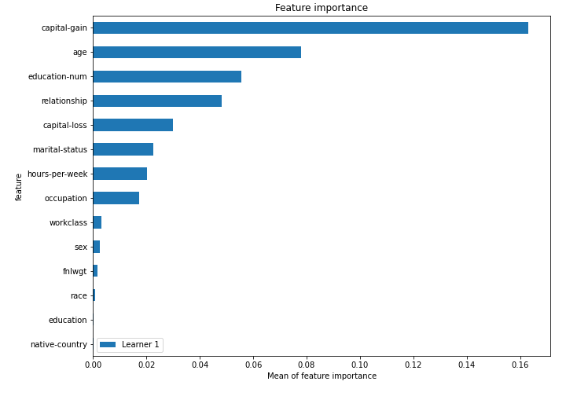
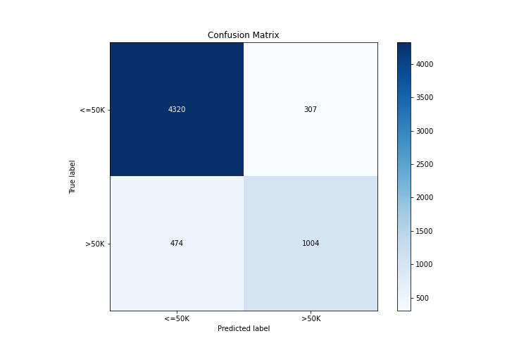
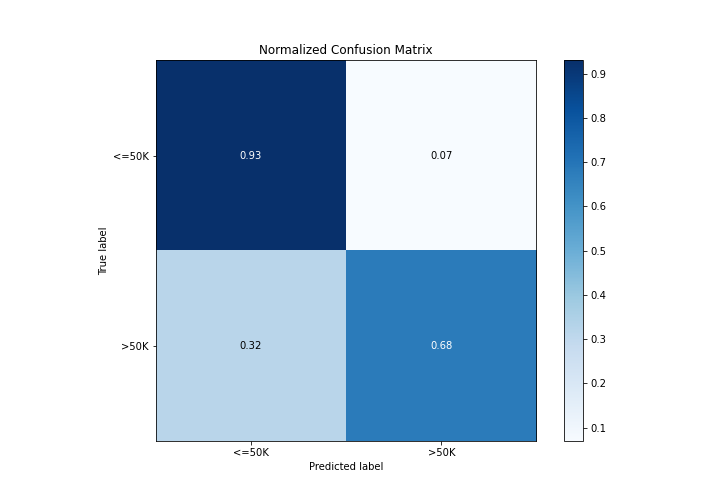
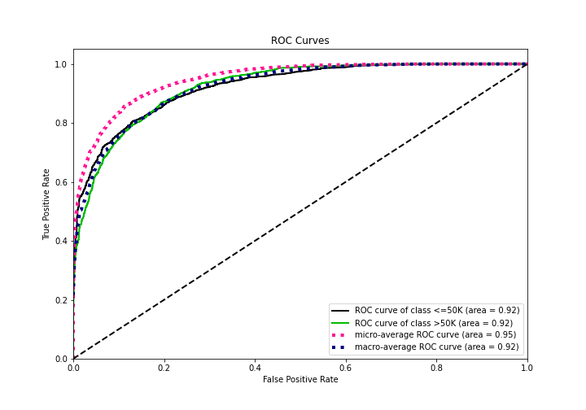
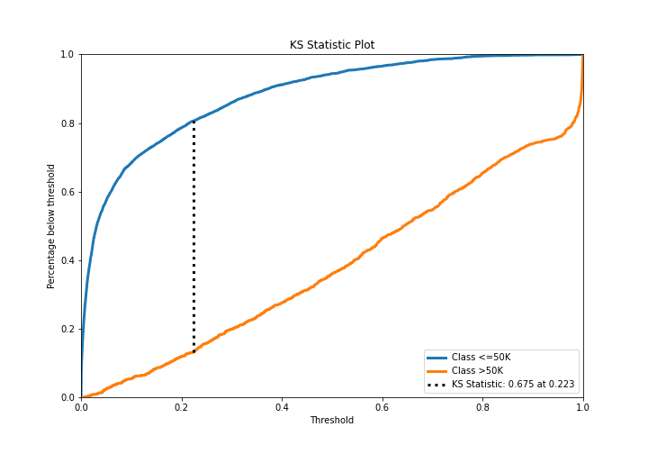
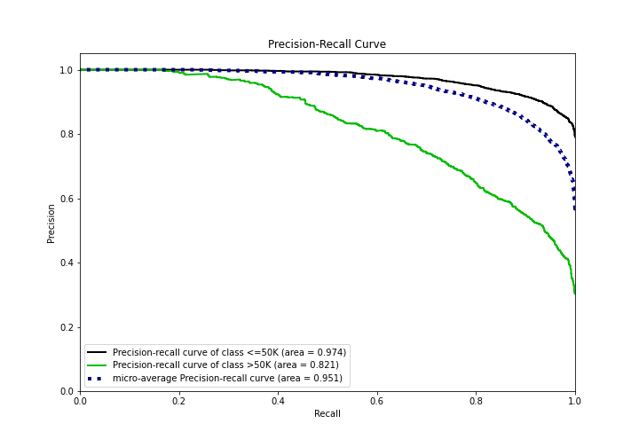
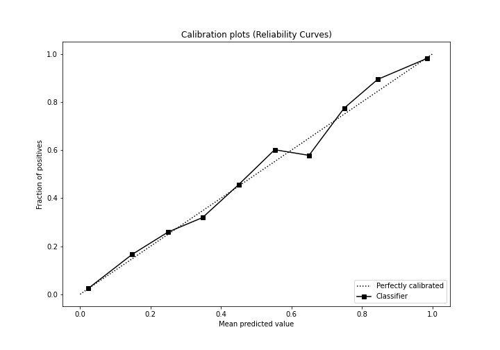
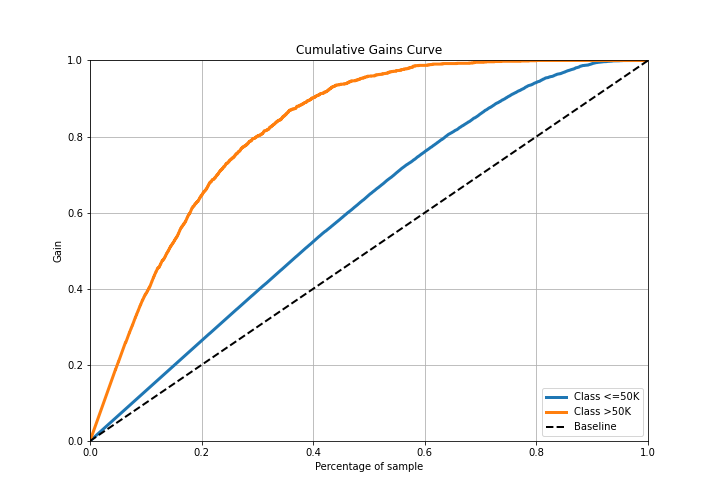
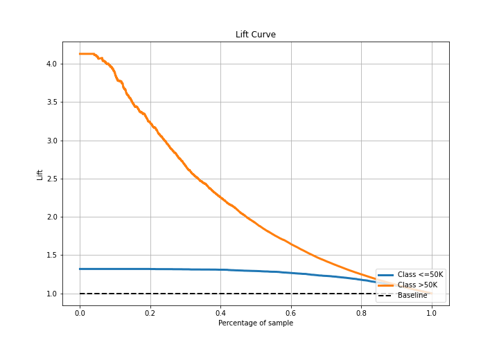

# Summary of 3_Default_Xgboost

[<< Go back](../README.md)

## Extreme Gradient Boosting (Xgboost)
- **n_jobs**: -1
- **objective**: binary:logistic
- **eta**: 0.075
- **max_depth**: 6
- **min_child_weight**: 1
- **subsample**: 1.0
- **colsample_bytree**: 1.0
- **eval_metric**: logloss
- **explain_level**: 2

## Validation
 - **validation_type**: split
 - **train_ratio**: 0.75
 - **shuffle**: True
 - **stratify**: True

## Optimized metric
logloss

## Training time

7.1 seconds

## Metric details
|           |    score |     threshold |
|:----------|---------:|--------------:|
| logloss   | 0.287101 | nan           |
| auc       | 0.923337 | nan           |
| f1        | 0.724783 |   0.385043    |
| accuracy  | 0.872072 |   0.459588    |
| precision | 0.977612 |   0.889447    |
| recall    | 1        |   6.97123e-05 |
| mcc       | 0.63938  |   0.459588    |

## Confusion matrix (at threshold=0.459588)
|                  |   Predicted as <=50K |   Predicted as >50K |
|:-----------------|---------------------:|--------------------:|
| Labeled as <=50K |                 4320 |                 307 |
| Labeled as >50K  |                  474 |                1004 |

## Learning curves

## Permutation-based Importance

## Confusion Matrix

## Normalized Confusion Matrix

## ROC Curve

## Kolmogorov-Smirnov Statistic

## Precision-Recall Curve

## Calibration Curve

## Cumulative Gains Curve

## Lift Curve

[<< Go back](../README.md)
