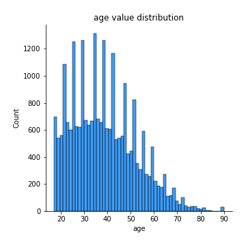
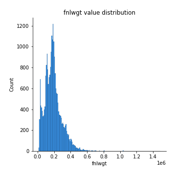

# Exploratory Data Analysis

[<< Go back](../README.md)
## Feature : target
- **Feature type** : categorical
- **Missing** : 0.0%
- **Unique** : 2
- **Count** :24420
- **Unique** :2
- **Top** :<=50K
- **Freq** :18509

## Feature : age
- **Feature type** : discrete
- **Missing** : 0.0%
- **Unique** : 71
- **Count** :24420.0
- **Mean** :38.536773136773135
- **Std** :13.56529692681604
- **Min** :17.0
- **25%th Percentile** : 28.0
- **50%th Percentile** : 37.0
- **75%th Percentile** : 47.0
- **Max** :90.0

## Feature : workclass
- **Feature type** : categorical
- **Missing** : 5.667485667485668%
- **Unique** : 8
- **Count** :23036
- **Unique** :8
- **Top** :Private
- **Freq** :16969

## Feature : fnlwgt
- **Feature type** : discrete
- **Missing** : 0.0%
- **Unique** : 17500
- **Count** :24420.0
- **Mean** :190262.27027027027
- **Std** :105629.79600407057
- **Min** :12285.0
- **25%th Percentile** : 118179.75
- **50%th Percentile** : 178774.5
- **75%th Percentile** : 237754.0
- **Max** :1484705.0

## Feature : education
- **Feature type** : categorical
- **Missing** : 0.0%
- **Unique** : 16
- **Count** :24420
- **Unique** :16
- **Top** :HS-grad
- **Freq** :7897

## Feature : education-num
- **Feature type** : discrete
- **Missing** : 0.0%
- **Unique** : 16
- **Count** :24420.0
- **Mean** :10.083865683865683
- **Std** :2.5715546591470257
- **Min** :1.0
- **25%th Percentile** : 9.0
- **50%th Percentile** : 10.0
- **75%th Percentile** : 12.0
- **Max** :16.0

## Feature : marital-status
- **Feature type** : categorical
- **Missing** : 0.0%
- **Unique** : 7
- **Count** :24420
- **Unique** :7
- **Top** :Married-civ-spouse
- **Freq** :11277

## Feature : occupation
- **Feature type** : categorical
- **Missing** : 5.687960687960688%
- **Unique** : 14
- **Count** :23031
- **Unique** :14
- **Top** :Prof-specialty
- **Freq** :3095

## Feature : relationship
- **Feature type** : categorical
- **Missing** : 0.0%
- **Unique** : 6
- **Count** :24420
- **Unique** :6
- **Top** :Husband
- **Freq** :9907

## Feature : race
- **Feature type** : categorical
- **Missing** : 0.0%
- **Unique** : 5
- **Count** :24420
- **Unique** :5
- **Top** :White
- **Freq** :20872

## Feature : sex
- **Feature type** : categorical
- **Missing** : 0.0%
- **Unique** : 2
- **Count** :24420
- **Unique** :2
- **Top** :Male
- **Freq** :16316

## Feature : capital-gain
- **Feature type** : discrete
- **Missing** : 0.0%
- **Unique** : 117
- **Count** :24420.0
- **Mean** :1086.55343980344
- **Std** :7485.456957381304
- **Min** :0.0
- **25%th Percentile** : 0.0
- **50%th Percentile** : 0.0
- **75%th Percentile** : 0.0
- **Max** :99999.0

## Feature : capital-loss
- **Feature type** : discrete
- **Missing** : 0.0%
- **Unique** : 91
- **Count** :24420.0
- **Mean** :89.39807534807535
- **Std** :408.28836607598856
- **Min** :0.0
- **25%th Percentile** : 0.0
- **50%th Percentile** : 0.0
- **75%th Percentile** : 0.0
- **Max** :4356.0

## Feature : hours-per-week
- **Feature type** : discrete
- **Missing** : 0.0%
- **Unique** : 92
- **Count** :24420.0
- **Mean** :40.452989352989356
- **Std** :12.244668170040741
- **Min** :1.0
- **25%th Percentile** : 40.0
- **50%th Percentile** : 40.0
- **75%th Percentile** : 45.0
- **Max** :99.0

## Feature : native-country
- **Feature type** : categorical
- **Missing** : 1.850941850941851%
- **Unique** : 40
- **Count** :23968
- **Unique** :40
- **Top** :United-States
- **Freq** :21860

[<< Go back](../README.md)
