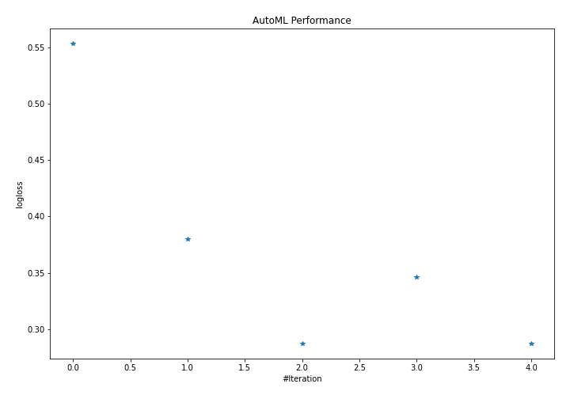
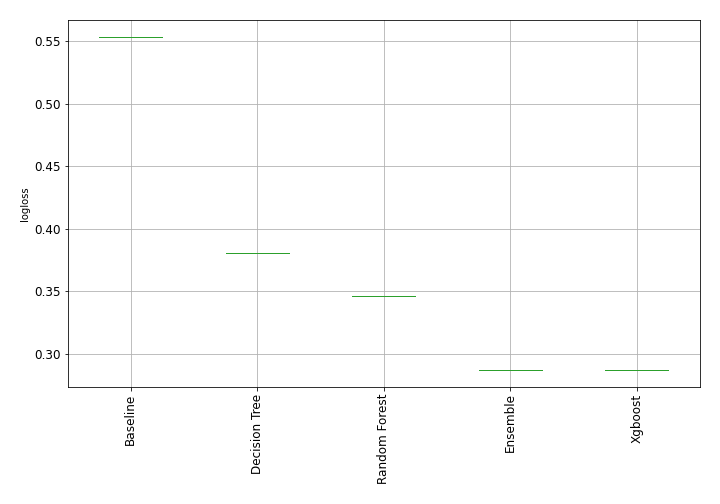
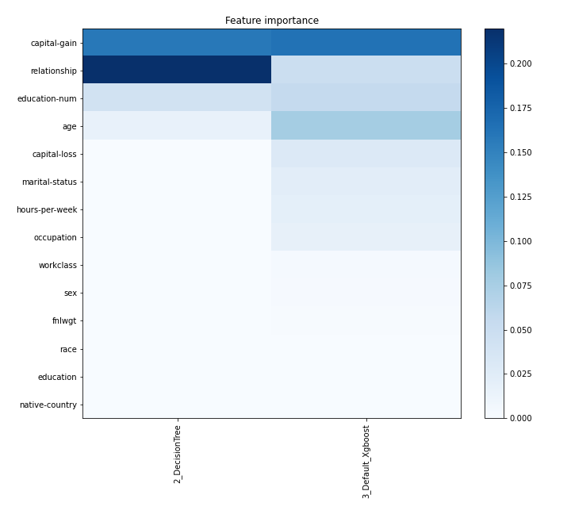
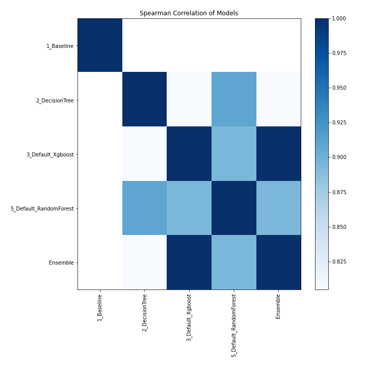

# AutoML Leaderboard

| Best model   | name                                                       | model_type    | metric_type   |   metric_value |   train_time |
|:-------------|:-----------------------------------------------------------|:--------------|:--------------|---------------:|-------------:|
|              | [1_Baseline](1_Baseline/README.md)                         | Baseline      | logloss       |       0.553485 |         2.82 |
|              | [2_DecisionTree](2_DecisionTree/README.md)                 | Decision Tree | logloss       |       0.38019  |        27.18 |
| **the best** | [3_Default_Xgboost](3_Default_Xgboost/README.md)           | Xgboost       | logloss       |       0.287101 |         8.39 |
|              | [5_Default_RandomForest](5_Default_RandomForest/README.md) | Random Forest | logloss       |       0.346198 |         7.23 |
|              | [Ensemble](Ensemble/README.md)                             | Ensemble      | logloss       |       0.287101 |         2.78 |

### AutoML Performance

### AutoML Performance Boxplot

### Features Importance

### Spearman Correlation of Models

