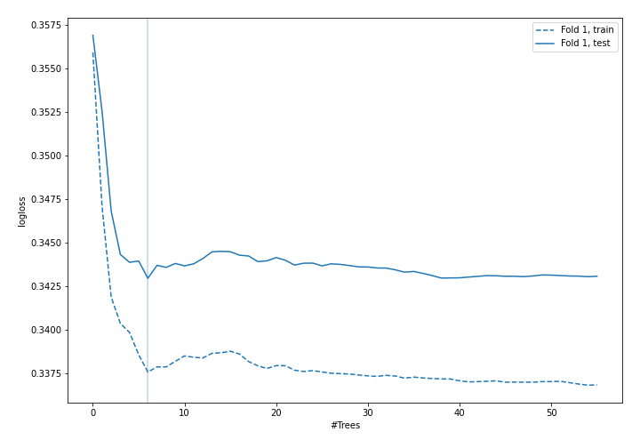
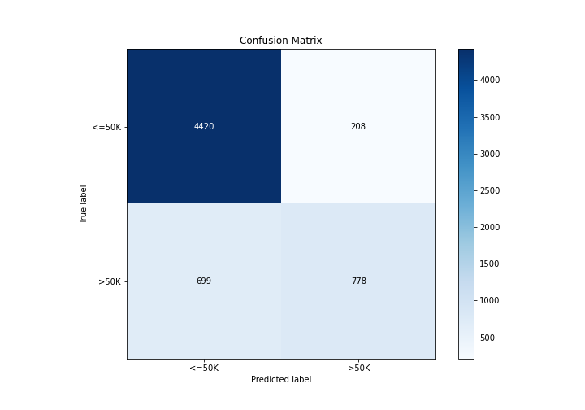

# Summary of 5_Default_RandomForest

[<< Go back](../README.md)

## Random Forest
- **n_jobs**: -1
- **criterion**: gini
- **max_features**: 0.9
- **min_samples_split**: 30
- **max_depth**: 4
- **eval_metric_name**: logloss
- **explain_level**: 2

## Validation
 - **validation_type**: split
 - **train_ratio**: 0.75
 - **shuffle**: True
 - **stratify**: True

## Optimized metric
logloss

## Training time

5.0 seconds

## Metric details
|           |    score |   threshold |
|:----------|---------:|------------:|
| logloss   | 0.342962 | nan         |
| auc       | 0.884021 | nan         |
| f1        | 0.643373 |   0.391396  |
| accuracy  | 0.851433 |   0.523556  |
| precision | 0.805017 |   0.631808  |
| recall    | 1        |   0.0249304 |
| mcc       | 0.560689 |   0.523556  |

## Confusion matrix (at threshold=0.523556)
|                  |   Predicted as <=50K |   Predicted as >50K |
|:-----------------|---------------------:|--------------------:|
| Labeled as <=50K |                 4420 |                 208 |
| Labeled as >50K  |                  699 |                 778 |

## Learning curves

## Confusion Matrix

[<< Go back](../README.md)
