# Exploratory Data Analysis

[<< Go back](../README.md)
## Feature : target
- **Feature type** : categorical
- **Missing** : 0.0%
- **Unique** : 2
- **Count** :24420
- **Unique** :2
- **Top** :<=50K
- **Freq** :18511

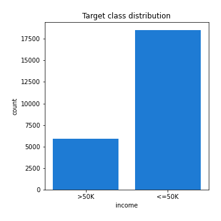
## Feature : age
- **Feature type** : discrete
- **Missing** : 0.0%
- **Unique** : 72
- **Count** :24420.0
- **Mean** :38.56109746109746
- **Std** :13.589935406252833
- **Min** :17.0
- **25%th Percentile** : 28.0
- **50%th Percentile** : 37.0
- **75%th Percentile** : 48.0
- **Max** :90.0

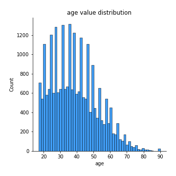
## Feature : workclass
- **Feature type** : categorical
- **Missing** : 5.569205569205569%
- **Unique** : 8
- **Count** :23060
- **Unique** :8
- **Top** :Private
- **Freq** :17038

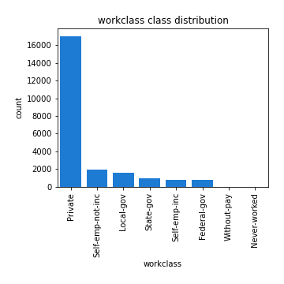
## Feature : fnlwgt
- **Feature type** : discrete
- **Missing** : 0.0%
- **Unique** : 17537
- **Count** :24420.0
- **Mean** :189291.63648648647
- **Std** :105576.76995326109
- **Min** :12285.0
- **25%th Percentile** : 117026.5
- **50%th Percentile** : 177992.0
- **75%th Percentile** : 236879.0
- **Max** :1484705.0

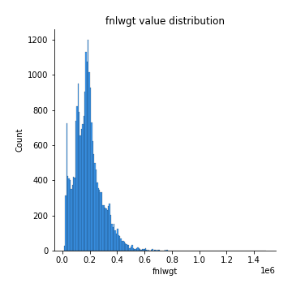
## Feature : education
- **Feature type** : categorical
- **Missing** : 0.0%
- **Unique** : 16
- **Count** :24420
- **Unique** :16
- **Top** :HS-grad
- **Freq** :7946

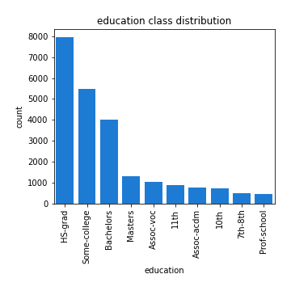
## Feature : education-num
- **Feature type** : discrete
- **Missing** : 0.0%
- **Unique** : 16
- **Count** :24420.0
- **Mean** :10.076945126945127
- **Std** :2.557471756270679
- **Min** :1.0
- **25%th Percentile** : 9.0
- **50%th Percentile** : 10.0
- **75%th Percentile** : 12.0
- **Max** :16.0

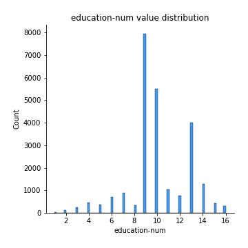
## Feature : marital-status
- **Feature type** : categorical
- **Missing** : 0.0%
- **Unique** : 7
- **Count** :24420
- **Unique** :7
- **Top** :Married-civ-spouse
- **Freq** :11244

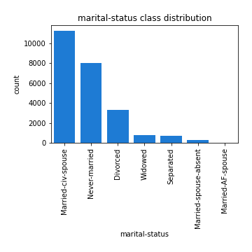
## Feature : occupation
- **Feature type** : categorical
- **Missing** : 5.593775593775594%
- **Unique** : 14
- **Count** :23054
- **Unique** :14
- **Top** :Craft-repair
- **Freq** :3101

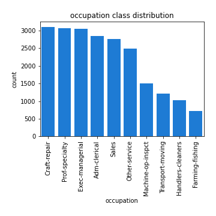
## Feature : relationship
- **Feature type** : categorical
- **Missing** : 0.0%
- **Unique** : 6
- **Count** :24420
- **Unique** :6
- **Top** :Husband
- **Freq** :9886

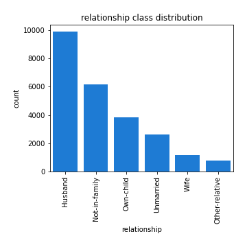
## Feature : race
- **Feature type** : categorical
- **Missing** : 0.0%
- **Unique** : 5
- **Count** :24420
- **Unique** :5
- **Top** :White
- **Freq** :20880

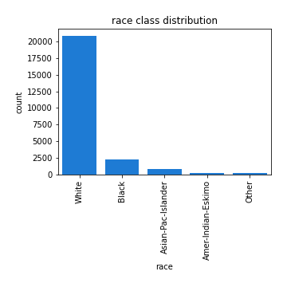
## Feature : sex
- **Feature type** : categorical
- **Missing** : 0.0%
- **Unique** : 2
- **Count** :24420
- **Unique** :2
- **Top** :Male
- **Freq** :16345

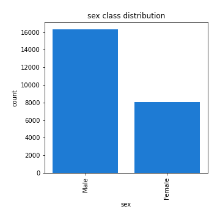
## Feature : capital-gain
- **Feature type** : discrete
- **Missing** : 0.0%
- **Unique** : 114
- **Count** :24420.0
- **Mean** :1112.7462325962326
- **Std** :7555.498283435626
- **Min** :0.0
- **25%th Percentile** : 0.0
- **50%th Percentile** : 0.0
- **75%th Percentile** : 0.0
- **Max** :99999.0

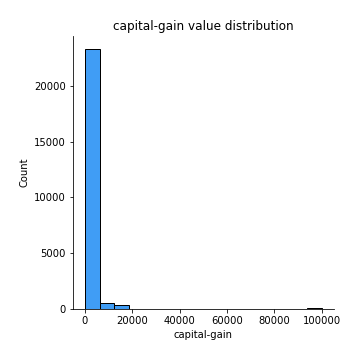
## Feature : capital-loss
- **Feature type** : discrete
- **Missing** : 0.0%
- **Unique** : 87
- **Count** :24420.0
- **Mean** :85.6974610974611
- **Std** :399.27880318172043
- **Min** :0.0
- **25%th Percentile** : 0.0
- **50%th Percentile** : 0.0
- **75%th Percentile** : 0.0
- **Max** :4356.0

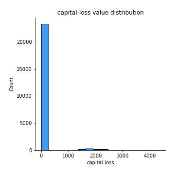
## Feature : hours-per-week
- **Feature type** : discrete
- **Missing** : 0.0%
- **Unique** : 92
- **Count** :24420.0
- **Mean** :40.430589680589684
- **Std** :12.365360476232594
- **Min** :1.0
- **25%th Percentile** : 40.0
- **50%th Percentile** : 40.0
- **75%th Percentile** : 45.0
- **Max** :99.0

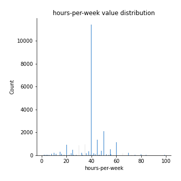
## Feature : native-country
- **Feature type** : categorical
- **Missing** : 1.805896805896806%
- **Unique** : 40
- **Count** :23979
- **Unique** :40
- **Top** :United-States
- **Freq** :21913

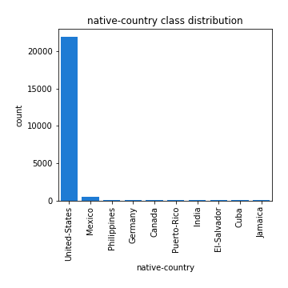

[<< Go back](../README.md)
