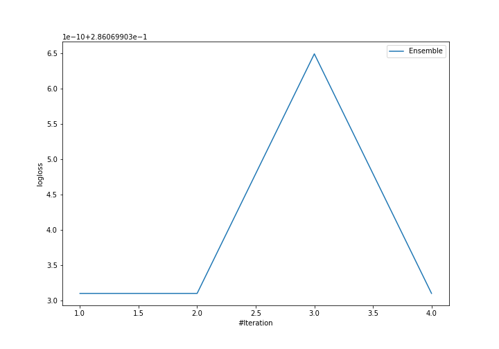
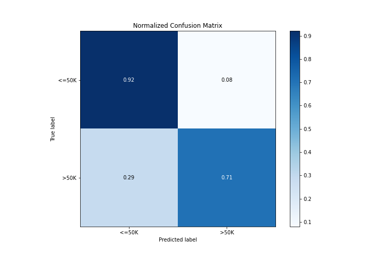
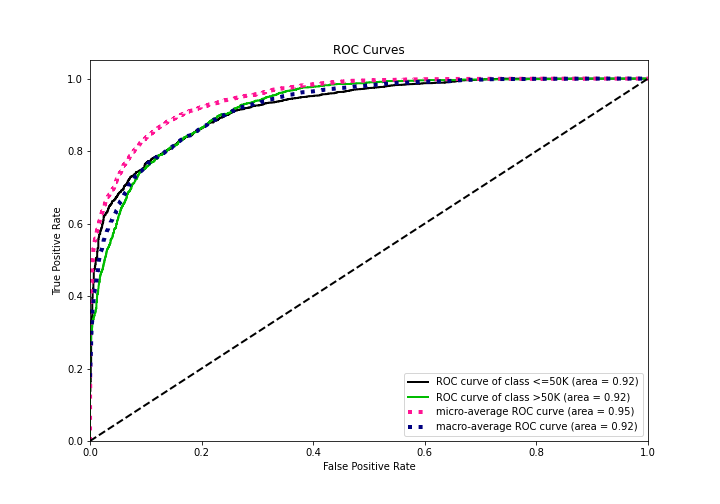
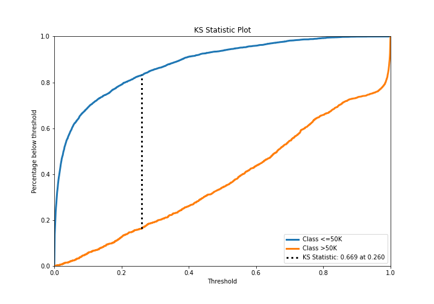
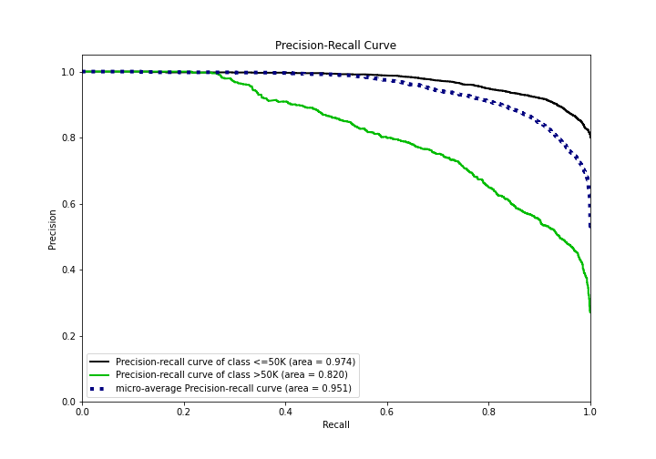
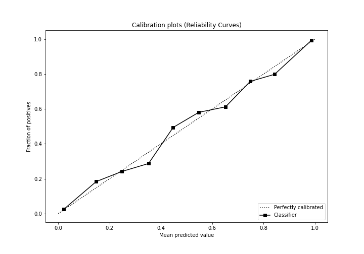
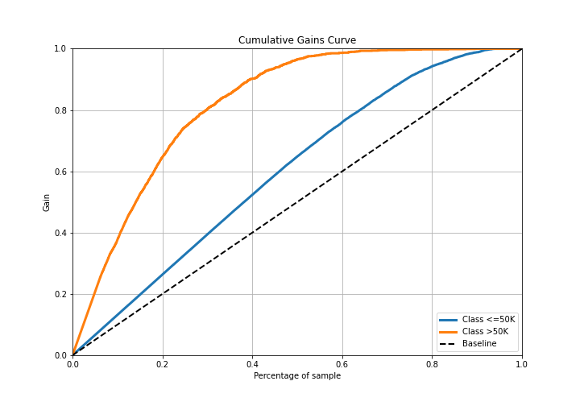
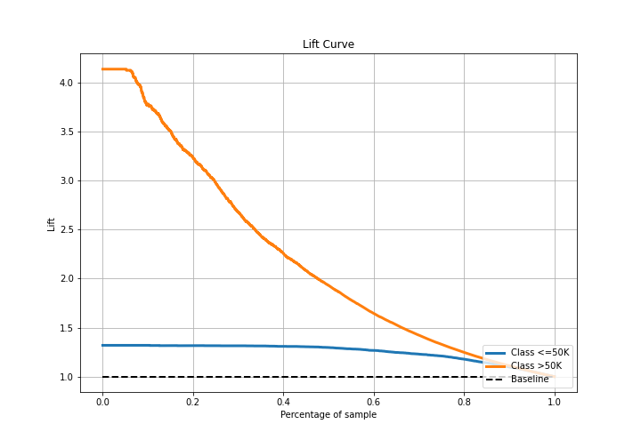

# Summary of Ensemble

[<< Go back](../README.md)

## Ensemble structure
| Model             |   Weight |
|:------------------|---------:|
| 3_Default_Xgboost |        1 |

## Metric details
|           |    score |     threshold |
|:----------|---------:|--------------:|
| logloss   | 0.28607  | nan           |
| auc       | 0.923757 | nan           |
| f1        | 0.732566 |   0.410916    |
| accuracy  | 0.871581 |   0.437338    |
| precision | 0.929348 |   0.789762    |
| recall    | 1        |   5.92485e-05 |
| mcc       | 0.647216 |   0.410916    |

## Confusion matrix (at threshold=0.437338)
|                  |   Predicted as <=50K |   Predicted as >50K |
|:-----------------|---------------------:|--------------------:|
| Labeled as <=50K |                 4277 |                 351 |
| Labeled as >50K  |                  433 |                1044 |

## Learning curves

## Confusion Matrix

## Normalized Confusion Matrix

## ROC Curve

## Kolmogorov-Smirnov Statistic

## Precision-Recall Curve

## Calibration Curve

## Cumulative Gains Curve

## Lift Curve

[<< Go back](../README.md)
